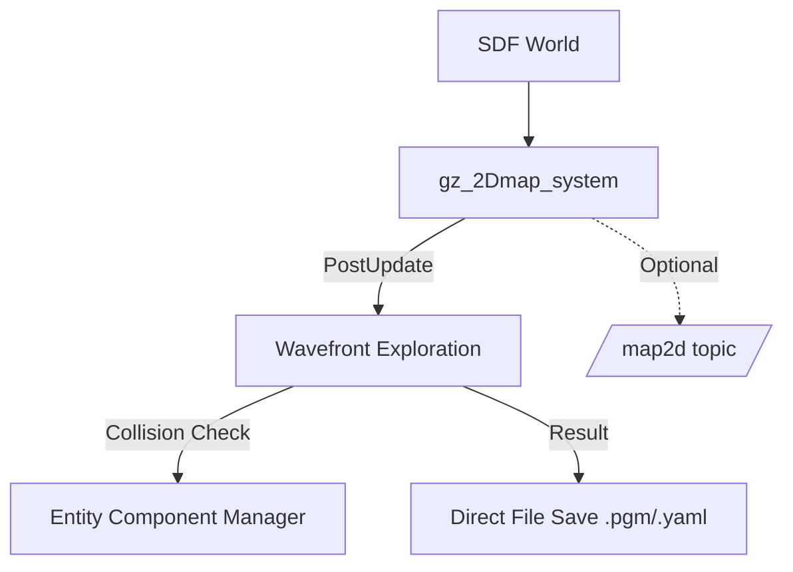

# Gazebo ROS 2 2D Map Plugin (Fortress)

**Automatically generate 2D occupancy maps from Ignition Gazebo Fortress worlds for ROS 2.**

This Ignition Gazebo system plugin creates occupancy grid maps for robot navigation without running SLAM. It works by slicing the Gazebo world at a configurable height and identifies obstacles through AABB collision detection.

Unlike the original Gazebo Classic plugin, this version is specifically designed for **Ignition Gazebo Fortress (gz-sim6)** and saves maps directly to PGM/YAML files to bypass communication limitations.

## Features

- **Automatic map generation** from any Ignition Gazebo world.
- **Direct file saving**: Saves map to `.pgm` and `.yaml` immediately (no ROS 2 bridge required for generation).
- **Auto-detection** of world bounds (no manual sizing needed).
- **Rotation-aware**: Correctly detects rotated objects (like walls).
- **Fully automated** script for plugin injection and map generation.
- **ROS 2 Humble** compatible.

## Quick Start

### Installation

```bash
cd ~/ros2_ws/src
git clone -b fortress https://github.com/robotics-upo/gazebo_ros2_2Dmap_plugin.git
cd ~/ros2_ws
colcon build --packages-select gazebo_ros2_2dmap_plugin
source install/setup.bash
```

### Automated Generation (Recommended)

The easiest way - automatically injects the plugin into your world and generates the map:

```bash
# Basic usage
ros2 run gazebo_ros2_2dmap_plugin generate_map.sh <world_file> [output_dir]

# Example
ros2 run gazebo_ros2_2dmap_plugin generate_map.sh ~/my_world.sdf ~/maps
```

**Output:** Creates `my_world.yaml` and `my_world.pgm` in the specified directory.

The script performs these steps automatically:
1.  Detects if the plugin is in the world file (injects it temporarily if missing).
2.  Launches Ignition Gazebo in server mode (headless).
3.  Triggers map generation via Ignition Transport service.
4.  Waits for the plugin to save the files directly to disk.
5.  Cleans up the temporary files.

## Configuration

### Plugin Parameters

| Parameter | Default | Description |
|-----------|---------|-------------|
| `map_resolution` | 0.05 | Cell size in meters (0.1m recommended for large worlds). |
| `map_height` | 0.3 | Height to slice the world in meters. |
| `map_size_x` | auto | Map width (omit for auto-detection). |
| `map_size_y` | auto | Map height (omit for auto-detection). |
| `map_margin` | 2.0 | Extra space in meters around auto-detected bounds. |
| `init_robot_x` | 0.0 | Starting X coordinate for exploration (must be free space). |
| `init_robot_y` | 0.0 | Starting Y coordinate for exploration (must be free space). |
| `output_path` | - | Base path for saving the `.pgm` and `.yaml` files. |

## Troubleshooting

### Map is all empty (white) or missing walls
- **Check Collisions**: The plugin detects obstacles using **collision geometries**. If your world models (like walls) only have `<visual>` elements but no `<collision>` elements, they will not be detected.
- **Map Height**: Ensure `map_height` (default 0.3) actually intersects with your obstacles.

### Map is all gray (unknown)
- **Start Position**: Ensure `init_robot_x/y` is in **free space**. If it starts inside a wall, the wavefront expansion will fail immediately.

### Generation times out
- For very large worlds (e.g., 100x100m) at high resolution (0.05), generation can take over 30 seconds. Try increasing `map_resolution` to 0.1 for faster results.

## Architecture

This plugin uses Ignition Gazebo's Entity-Component-System (ECS) architecture.



## Credits and License

This package is licensed under the MIT License.

Forked from [marinaKollmitz/gazebo_ros_2Dmap_plugin](https://github.com/marinaKollmitz/gazebo_ros_2Dmap_plugin), originally based on ETH Zürich's [octomap plugin](https://github.com/ethz-asl/rotors_simulator/tree/master/rotors_gazebo_plugins). This version adds ROS 2 Humble support, Gazebo 11 Classic compatibility, automatic map sizing, and automated generation scripts.
